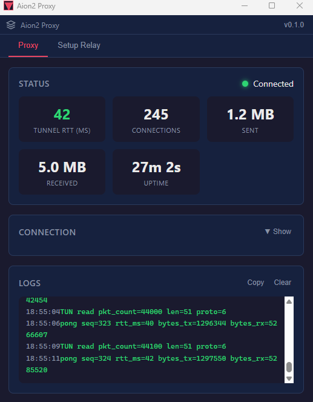

# Aion2 Network Accelerator

A lightweight desktop app that speeds up your connection to **Aion2 Taiwan** game servers by routing game traffic through a relay server in Taiwan — bypassing geo-blocking and reducing latency for players outside Taiwan.

## What It Does

If you play Aion2 Taiwan from Japan (or anywhere outside Taiwan), you've probably noticed high ping and connection issues. This is because:

- The game servers are on **HiNet** (Chunghwa Telecom) in Taipei
- Many ISPs route traffic through indirect paths, adding 50–100ms of unnecessary latency
- Some ISPs throttle gaming-related traffic

**Aion2 Network Accelerator** solves this by:

1. Routing all TCP traffic through a TUN adapter on your PC
2. Sending it through an encrypted TCP tunnel to a relay server you control in Taiwan
3. The relay forwards your traffic directly to the game servers over a fast local connection

The result: significantly lower ping and a smoother gameplay experience.

## Features

- **One-click relay setup** — Deploy the relay server to your own Taiwan VPS via SSH, directly from the app (no command line needed)
- **Simple start/stop** — Toggle the proxy on and off with a single button
- **Real-time dashboard** — Live latency, uptime, active connections, and data transfer stats
- **Connection profiles** — Save and switch between multiple VPS configurations
- **Encrypted tunnel** — All traffic between your PC and the relay is encrypted (XChaCha20-Poly1305)
- **Lightweight** — The relay binary is ~1.8 MB and uses under 300 KB of RAM on the server
- **Auto-updater** — Check for new versions from within the app

## Screenshots



## Requirements

### For Players (Using the App)

- **Windows 10/11** (the proxy uses a Windows-specific network driver)
- A **Taiwan VPS** (virtual private server) to act as your relay — [MoonVM](https://moonvm.com/) is recommended for its low latency to HiNet game servers (~2ms)
- The VPS needs: Ubuntu 20.04+, a public IP, and SSH access

### For Development

- **Rust** (latest stable) — [Install Rust](https://rustup.rs/)
- **Node.js 18+** and **npm** — [Install Node.js](https://nodejs.org/)
- **Tauri 2 prerequisites** — See [Tauri Getting Started](https://v2.tauri.app/start/prerequisites/)
- For cross-compiling the relay binary:
  - [Zig](https://ziglang.org/download/) (used by cargo-zigbuild)
  - `cargo install cargo-zigbuild`
  - `rustup target add x86_64-unknown-linux-musl`

## Quick Start (Players)

1. **Download** the latest installer from the [Releases](../../releases) page
2. **Install** and launch **Aion2 Proxy**
3. Go to the **Setup Relay** tab:
   - Enter your Taiwan VPS IP, SSH port, username, and password
   - Click **"Deploy Relay"** — the app will automatically install and configure the relay on your VPS
4. Switch to the **Proxy** tab:
   - The relay address and key are auto-filled after a successful deploy
   - Click **"Start Proxy"**
5. **Launch Aion2** — game traffic is now routed through your relay

## How It Works

```
Your PC (Japan)                    Taiwan VPS                  Game Server
┌──────────────┐    encrypted     ┌──────────────┐   direct  ┌───────────┐
│  Aion2 Proxy │ ──── TCP ──────► │  Aion2 Relay │ ── TCP ─► │  Aion2 TW │
│  (captures   │    (~40ms)       │  (forwards   │  (~2ms)   │  (HiNet)  │
│  game traffic│ ◄── TCP ──────── │  to game)    │ ◄─ TCP ── │           │
└──────────────┘                  └──────────────┘           └───────────┘
```

The proxy captures game-bound network packets on your PC using a TUN adapter, encrypts them, and sends them via a TCP tunnel to the relay server. The relay decrypts the traffic, opens a real TCP connection to the game server, and forwards it. Responses travel the same path in reverse.

All public IP traffic is routed through the tunnel (full-tunnel mode). Private networks (LAN) and the relay server IP are excluded.

## Project Structure

```
crates/
├── aion2-common/    Shared library: tunnel protocol, encryption, serialization
├── aion2-relay/     Relay daemon that runs on the Taiwan VPS
├── aion2-proxy/     Client-side proxy engine (TUN adapter, TCP reassembly, tunnel)
└── aion2-app/       Tauri 2 desktop GUI (wraps the proxy + deploy logic)
ui/                  Vue + TypeScript frontend for the desktop app
```

## Contributing

Contributions are welcome! Here's how to get started:

### Setting Up the Dev Environment

```bash
# Clone the repo
git clone https://github.com/portwatcher/aion2-network-accelerator.git
cd aion2-network-accelerator

# Install frontend dependencies
cd ui && npm install && cd ..

# Run the Tauri dev server (hot-reload for both Rust and frontend)
cd ui && npm run dev &
cd crates/aion2-app && cargo tauri dev
```

### Building

```bash
# Build the relay binary (static Linux binary for deployment to VPS)
cargo zigbuild --release --target x86_64-unknown-linux-musl -p aion2-relay

# Build the desktop app
cd ui && npm run build && cd ..
cd crates/aion2-app && cargo tauri build
```

### Dev Testing on macOS/Linux

The proxy's TUN adapter only works on Windows, but you can test the tunnel logic on macOS/Linux using a test mode:

```bash
# Run the relay locally
cargo run -p aion2-relay -- --key-dir ./keys --listen 127.0.0.1:9443

# Run the proxy in test mode (connects to a destination instead of using TUN)
AION2_TEST_DST=210.242.123.135:13328 cargo run -p aion2-proxy -- \
  --relay 127.0.0.1:9443 --key <hex-key>
```

### Areas Where Help is Needed

- **System tray / minimize to tray** — Keep the app running in the background
- **Auto-reconnect** — Automatically reconnect when the tunnel drops
- **Latency graph** — Visualize ping over time in the dashboard
- **Game process detection** — Auto-start/stop the proxy when Aion2 launches or closes
- **Testing** — Additional unit and integration tests
- **Documentation** — Translations, user guides, VPS setup walkthroughs

### Code Overview

| Crate | Purpose |
|-------|---------|
| `aion2-common` | Tunnel packet format (`TunnelMessage` enum), XChaCha20-Poly1305 encryption, bincode framing |
| `aion2-relay` | Multi-user TCP tunnel forwarder daemon — receives encrypted tunnel traffic, opens real TCP to game, relays responses. Supports hot-reload via SIGHUP |
| `aion2-proxy` | Client engine — creates TUN adapter (wintun on Windows), implements userspace TCP stack, encrypts and tunnels to relay over TCP |
| `aion2-app` | Tauri 2 shell — IPC commands for start/stop/status, SSH deploy logic, connection profile management |
| `ui/` | Vue 3 frontend — dashboard with real-time stats, deploy wizard, profile management, log viewer |

## License

This project is licensed under the [MIT License](LICENSE).

## Acknowledgments

- [Tauri](https://tauri.app/) — Desktop app framework
- [wintun-bindings](https://crates.io/crates/wintun) — Rust bindings for wintun
- [wintun](https://www.wintun.net/) — Windows TUN adapter
- [cargo-zigbuild](https://github.com/rust-cross/cargo-zigbuild) — Cross-compilation toolchain
